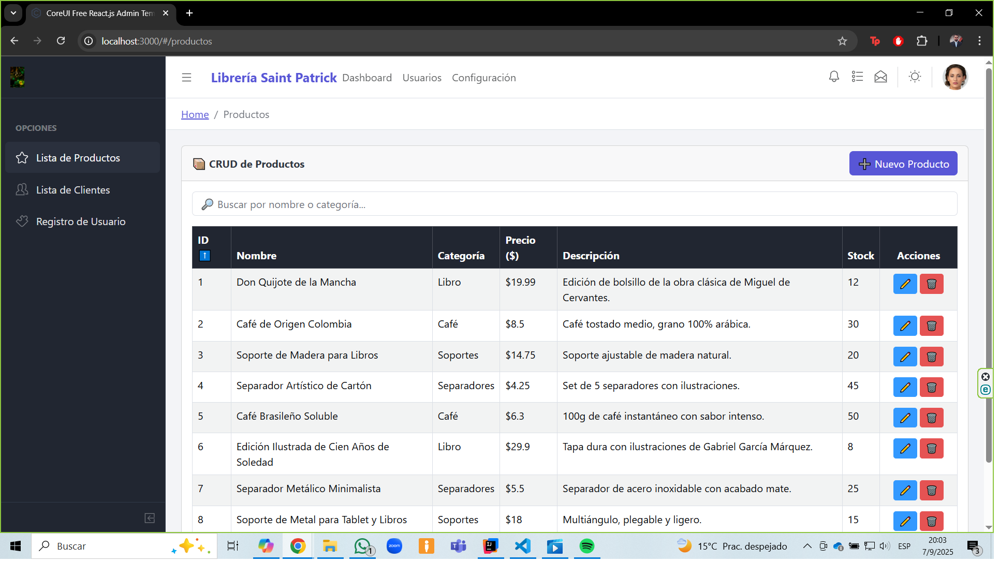

# 📚 Librería Virtual - Proyecto eCommerce

Bienvenido al repositorio de la **Librería Virtual**, llamada "Librería Saint Patrick", una plataforma eCommerce desarrollada como proyecto académico. Este sitio permite explorar productos relacionados con la lectura, como libros físicos, café artesanal, separadores y soportes para libros, con un diseño responsivo y una arquitectura profesional.

---

## 🧠 Descripción del Proyecto

Este proyecto tiene como objetivo aplicar buenas prácticas de desarrollo web y arquitectura de software, integrando tecnologías modernas en el frontend y una estructura sólida en el backend. Se ha trabajado con especial atención a la organización de carpetas, claridad del código, mantenibilidad y presentación académica.

La aplicación incluye funcionalidades como:

- CRUD completo de productos y clientes
- Validación de formularios en tiempo real
- Consumo de datos desde una API RESTful simulada
- Navegación SPA con React Router
- Interfaz responsiva y profesional basada en CoreUI

---

## 🛠️ Tecnologías Utilizadas

### 🔹 Frontend
- **React** para construir una SPA dinámica y modular
- **CoreUI React Admin Template** como base visual
- **Axios** para consumir datos desde la API
- **JSON Server** para simular un backend RESTful
- **Bootstrap 4** para diseño responsivo
- **JavaScript** para lógica de interacción

### 🔹 Backend
- **Java** con estructura orientada a objetos
- Organización profesional de paquetes en **IntelliJ IDEA**
- Clases como `Producto`, `Usuario`, `Carrito`, con encapsulamiento y herencia
- Nota: el backend se encuentra en otro repositorio y será integrado próximamente

### 🔹 Herramientas de documentación
- **README.md** con capturas, descripción técnica y desafíos
- **GitHub** para control de versiones y publicación
- **UML** para modelado de entidades y relaciones

---

## 📸 Capturas de Pantalla

A continuación se muestran ejemplos de visualización de los diferentes módulos actuales del proyecto:

### 🖥️ Vista en escritorio

---

## 🧩 Desafíos enfrentados y soluciones

### 🔸 Problema de ruta dentro de Productos.js
**Problema:** Existía un llamado al servicio con una sintaxis que no coincidía conla del servicio y provocaba un error.  
**Solución:** Corrección de la sintaxis para poder llamar al servicio.

### 🔸 Ruta equivocada hacia la base de datos
**Problema:** Se presentaba un error 404 (not found) al intentar desplegar la tabla de productos debido a una escritura equivocada del nombre de uno de los campos de la base de datos ficticia.  
**Solución:** Se corrigió el llamado y posteriormente los datos fueron presentados sin problemas.

---

## 🙌 Autor

**Patricio Agurto**
Estudiante de Maestría en Ingeniería de Software y Sistemas Informáticos en Broward International University.

---