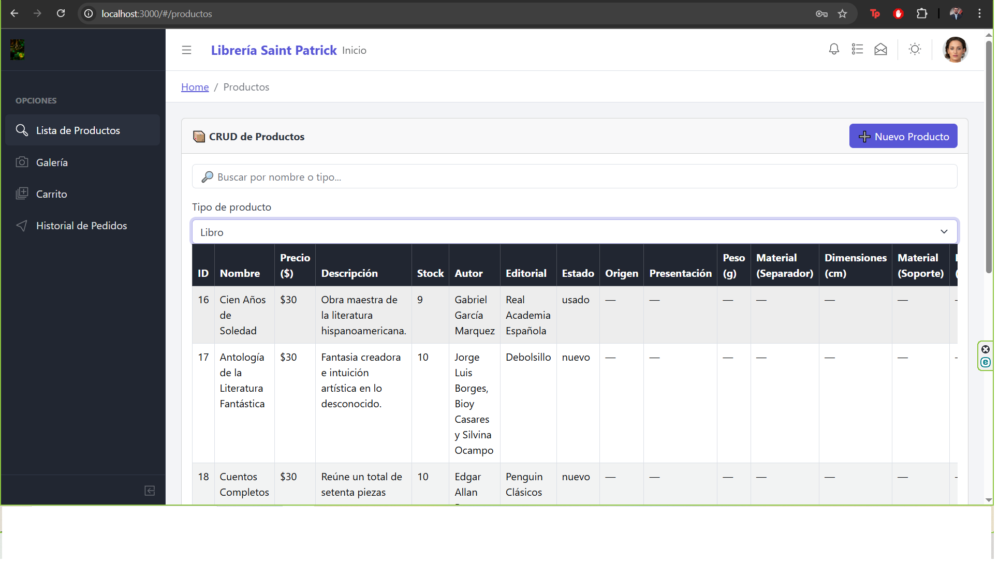
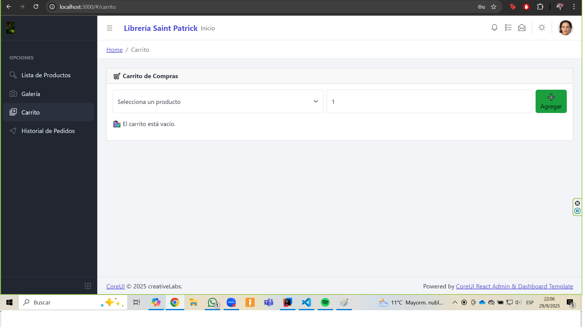
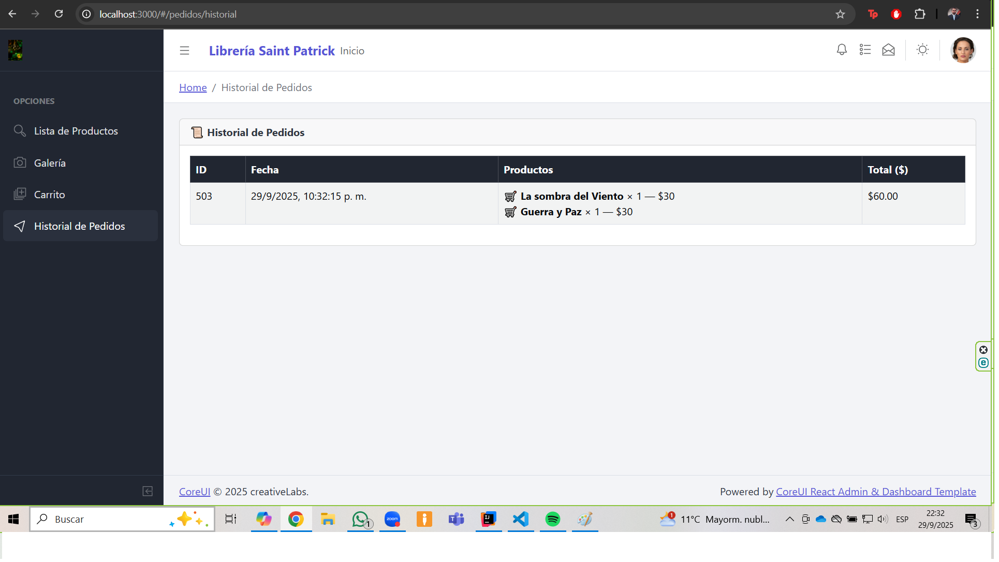
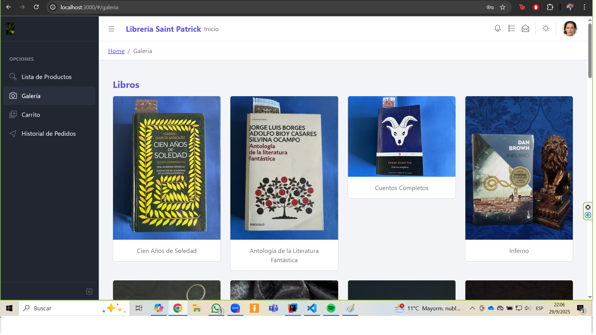
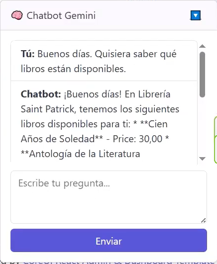

# 📚 Librería Virtual - Proyecto eCommerce

Bienvenido al repositorio de la Librería Saint Patrick, una plataforma eCommerce desarrollada como proyecto académico. Este sitio permite explorar productos relacionados con la lectura, como libros físicos, café artesanal, separadores y soportes para libros, con un diseño responsivo, arquitectura profesional y una integración completa con el backend en Java.

---

## 🧠 Descripción del Proyecto

Este proyecto tiene como objetivo aplicar buenas prácticas de desarrollo web y arquitectura de software, integrando tecnologías modernas en el frontend y una estructura sólida en el backend. Se ha trabajado con especial atención a la organización de carpetas, claridad del código, mantenibilidad y presentación académica.

La aplicación incluye funcionalidades como:

- CRUD completo de productos y clientes
- Validación de formularios en tiempo real
- Consumo de datos desde una API RESTful simulada
- Navegación SPA con React Router
- Interfaz responsiva y profesional basada en CoreUI
- Gestión de carrito persistente en sesión
- Pago de carrito con persistencia en base de datos
- Consumo de datos desde una API RESTful real (Spring Boot + MySQL)

---

## 🛠️ Tecnologías Utilizadas

### 🔹 Frontend
- **React** para construir una SPA dinámica y modular
- **CoreUI React Admin Template** como base visual
- **Axios** para consumir datos desde la API
- **Bootstrap 4** para diseño responsivo
- **JavaScript** para lógica de interacción
- **React Router DOM** para navegación entre vistas
- **Session Storage / HttpSession** para persistencia del carrito

### 🔹 Backend
- **Spring Boot + Java 17** con arquitectura limpia
- **Spring Data JPA** para persistencia
- **MySQL 8.x** como base de datos relacional
- **DTOs y mapeadores personalizados** para evitar ciclos y controlar la estructura de respuesta
- **Controladores REST** para cada entidad
- Gestión de pedidos y productos con trazabilidad completa

### 🔹 Herramientas de documentación
- **README.md** con capturas, descripción técnica y desafíos
- **GitHub** para control de versiones y publicación
- **UML** para modelado de entidades y relaciones
- **Postman** para pruebas de endpoints

---

## 📸 Capturas de Pantalla

A continuación se muestran ejemplos de visualización de los diferentes módulos actuales del proyecto:

### 🖥️ Vista en escritorio

---

## 🧩 Desafíos enfrentados y soluciones

### 🔸 Problema de ruta dentro de Productos.js
**Problema:** Existía un llamado al servicio con una sintaxis que no coincidía conla del servicio y provocaba un error.  
**Solución:** Corrección de la sintaxis para poder llamar al servicio.

### 🔸 Ruta equivocada hacia la base de datos
**Problema:** Se presentaba un error 404 (not found) al intentar desplegar la tabla de productos debido a una escritura equivocada del nombre de uno de los campos de la base de datos ficticia.  
**Solución:** Se corrigió el llamado y posteriormente los datos fueron presentados sin problemas.

## 🔸 Integración real con backend
**Problema:** La aplicación usaba JSON Server simulado, lo que limitaba la persistencia real.
**Solución:** Se migró a un backend real con Spring Boot y MySQL, ajustando rutas, servicios y DTOs.

## 🔸 Serialización de relaciones bidireccionales
**Problema:** Al consumir pedidos, los ítems no se cargaban correctamente por relaciones LAZY.
**Solución:** Se corrigió el mapeo en entidades y se recargó el pedido con EntityGraph para incluir productos.

## 🔸 Persistencia del carrito
**Problema:** El carrito se perdía al recargar la página.
**Solución:** Se implementó persistencia en sesión (HttpSession) y limpieza automática tras el pago.

## 🔸 Limitación de uso de api key en Google Cloud
**Problema:** No se podían acceder a tecnologías de chatbot con la api key.
**Solución:** Se implementó facturación en la cuenta y se pudo acceder a herramientas más potentes con VertexAI.

---

## 🙌 Autor

**Patricio Agurto**
Estudiante de Maestría en Ingeniería de Software y Sistemas Informáticos en Broward International University.

---