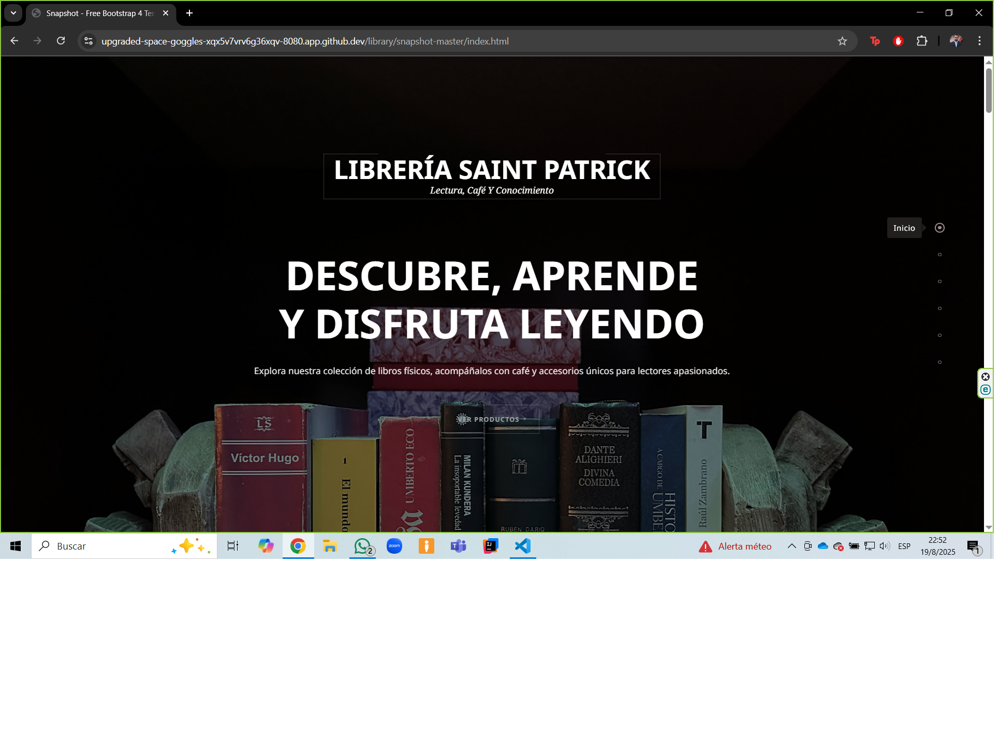
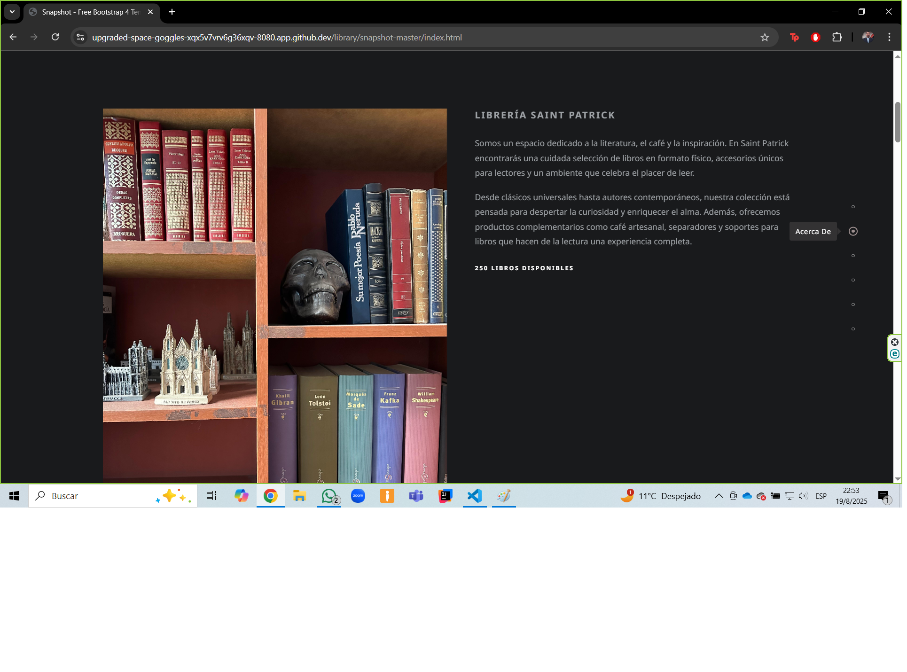
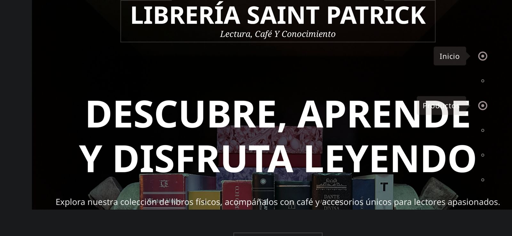

# 📚 Librería Virtual - Proyecto eCommerce

Bienvenido al repositorio de la **Librería Virtual**, llamada "Librería Saint Patrick" una plataforma eCommerce desarrollada como proyecto académico. Este sitio permite explorar productos relacionados con la lectura, como libros físicos, café artesanal, separadores y soportes para libros, con un diseño responsivo y una arquitectura profesional.

---

## 🧠 Descripción del Proyecto

Este proyecto tiene como objetivo aplicar buenas prácticas de desarrollo web y arquitectura de software, integrando tecnologías modernas en el frontend y una estructura sólida en el backend. Se ha trabajado con especial atención a la organización de carpetas, claridad del código, mantenibilidad y presentación académica.

---

## 🛠️ Tecnologías Utilizadas

### 🔹 Frontend
- **HTML5** y **CSS3** para la estructura y estilos base.
- **Bootstrap 4** para diseño responsivo y componentes visuales.
- **JavaScript** para interactividad y futuras integraciones dinámicas del backend.

### 🔹 Backend
- **Java** con estructura orientada a objetos
- Organización profesional de paquetes en **IntelliJ IDEA**
- Clases como `Producto`, `Usuario`, `Carrito` con encapsulamiento y métodos analíticos
- Nota: el backend se encuentra en otro repositorio y será añadido al proyecto una vez que se establezca la conexión entre frontend y backend.

### 🔹 Herramientas de documentación
- **README.md** con capturas y UML
- **GitHub** para control de versiones y publicación
- **UML** para modelado de entidades y relaciones

---

## 📸 Capturas de Pantalla

A continuación se muestran ejemplos de la página web en distintos tamaños de pantalla para demostrar su responsividad:

### 🖥️ Vista en escritorio

### 📱 Vista en móvil

---

## 🧩 Desafíos enfrentados y soluciones

### 🔸 Desalineación de tarjetas por imágenes de distinto tamaño
**Problema:** Algunas imágenes generaban espacios en blanco por tener proporciones diferentes.
**Solución:** Se ajustó el alto de las tarjetas (`card`) y se aplicaron clases personalizadas para adaptar el diseño sin recortar contenido importante.

### 🔸 Etiquetas mal referenciadas
**Problema:** Algunas referencias no coincidían con las nuevas etiquetas en la reestructuración de la interfaz.
**Solución:** Se cambió la referencia para que el menú siga siendo dinámico en la página.

### 🔸 Pérdida del fondo
**Problema:** El color de fondo se perdía en algunas nuevas secciones de la página.
**Solución:** Se implementó un color que coincida con  el fondo original de la plantilla.

---

## 🙌 Autor

**Patricio Agurto**
Estudiante de Maestría en Ingeniería de Software y Sistemas Informáticos en Broward International University.

---
