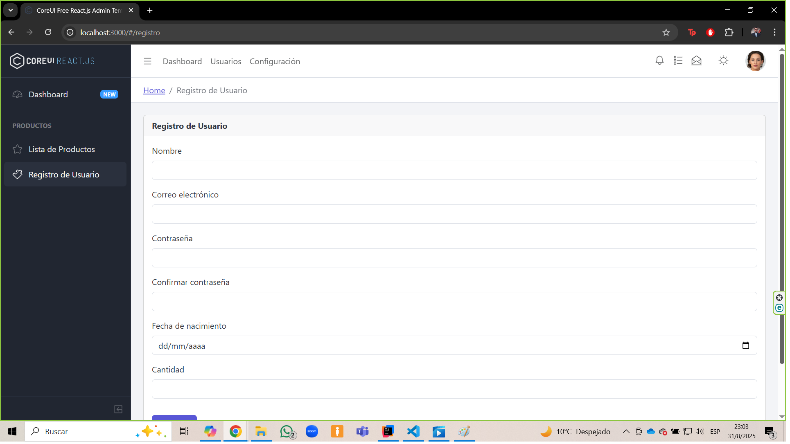

# 📚 Librería Virtual - Proyecto eCommerce

Bienvenido al repositorio de la **Librería Virtual**, llamada "Librería Saint Patrick" una plataforma eCommerce desarrollada como proyecto académico. Este sitio permite explorar productos relacionados con la lectura, como libros físicos, café artesanal, separadores y soportes para libros, con un diseño responsivo y una arquitectura profesional.

---

## 🧠 Descripción del Proyecto

Este proyecto tiene como objetivo aplicar buenas prácticas de desarrollo web y arquitectura de software, integrando tecnologías modernas en el frontend y una estructura sólida en el backend. Se ha trabajado con especial atención a la organización de carpetas, claridad del código, mantenibilidad y presentación académica.

---

## 🛠️ Tecnologías Utilizadas

### 🔹 Frontend
- **HTML5** y **CSS3** para la estructura y estilos base.
- **Bootstrap 4** para diseño responsivo y componentes visuales.
- **JavaScript** para interactividad y futuras integraciones dinámicas del backend.
- **React** para crear una página web dinámica
- **node** para crear pruebas en servidor ficticio
- **JSON Server** para el envío de datos desde una API RESTful ficticia 

### 🔹 Backend
- **Java** con estructura orientada a objetos
- Organización profesional de paquetes en **IntelliJ IDEA**
- Clases como `Producto`, `Usuario`, `Carrito` con encapsulamiento y métodos analíticos
- Nota: el backend se encuentra en otro repositorio y será añadido al proyecto una vez que se establezca la conexión entre frontend y backend.

### 🔹 Herramientas de documentación
- **README.md** con capturas y UML
- **GitHub** para control de versiones y publicación
- **UML** para modelado de entidades y relaciones

---

## 📸 Capturas de Pantalla

A continuación se muestran ejemplos de la página web en distintos tamaños de pantalla para demostrar su responsividad:

### 🖥️ Vista en escritorio

---

## 🧩 Desafíos enfrentados y soluciones

### 🔸 Imposibilidad de crear página web dinámica con plantilla Bootstrap
**Problema:** La plantilla utilizada anteriormente no usaba ningún framework frontend y no permitía el manejo dinámico de los datos.
**Solución:** Se migró a otra plantilla que trabaja con React llamada: CoreUI Free React Admin Template.

### 🔸 Sintaxis incorrecta en el componente de verificación de ususario
**Problema:** Se escribió el archivo en TypeScript, pero la plantilla sólo trabaja con sintaxis JavaScript.
**Solución:** Se creó el componente RegistroUsuario en JavaScript para que exista consistencia con la estructura de la plantilla.

La parte de cantidad en el registro de usuario se implementó s+olo con propósitos académicos para validar números en el formulario de forma dinámica.

---

## 🙌 Autor

**Patricio Agurto**
Estudiante de Maestría en Ingeniería de Software y Sistemas Informáticos en Broward International University.

---